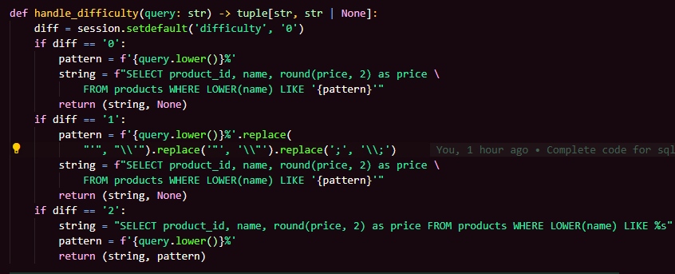
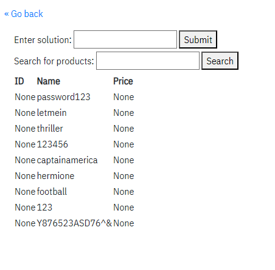
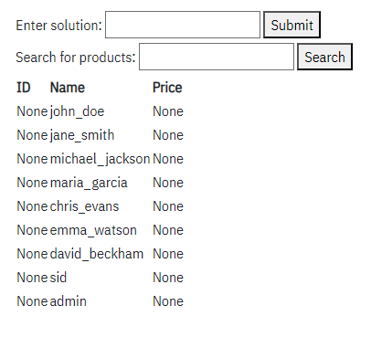
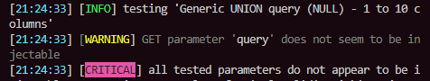

# SQL Injection Challenge

## Overview

The SQL Injection Challenge web page provides an interface for filtering the list of products by name. The challenge is to find the password for 'admin'.

## Difficulties

The levels of difficulty add increasing amounts of sanitization for user inputs.

Here's the code controlling difficulty:

## No Security

At this difficulty, the query is passed exactly as it was entered. Also, errors are sent to the browser
verbatim, which shows the query being executed.

One way to solve the No Security version is a query like this one:

`%';select username as product_id, password as price, NULL as name from users where username like '`

## Some Security

At Some Security, the server adds backslashes in front of dangerous characters (single quotes, double quotes, semi-colons). The example given for No Security will not work at this level. However, the endpoint is still vulnerable to UNION-based SQL Injection.

For instance, sqlmap found this payload to be a valid attack vector:

`1' UNION ALL SELECT NULL,(CHR(113)||CHR(118)||CHR(122)||CHR(112)||CHR(113))||(CHR(121)||CHR(82)||CHR(75)||CHR(87)||CHR(99)||CHR(71)||CHR(83)||CHR(72)||CHR(90)||CHR(66)||CHR(68)||CHR(87)||CHR(77)||CHR(86)||CHR(77)||CHR(104)||CHR(100)||CHR(108)||CHR(79)||CHR(73)||CHR(104)||CHR(102)||CHR(110)||CHR(68)||CHR(67)||CHR(78)||CHR(101)||CHR(75)||CHR(78)||CHR(114)||CHR(82)||CHR(69)||CHR(120)||CHR(107)||CHR(73)||CHR(70)||CHR(87)||CHR(120)||CHR(87)||CHR(114))||(CHR(113)||CHR(118)||CHR(107)||CHR(118)||CHR(113)),NULL-- CRxP`

After adjusting the query for the challenge, this difficulty could be solved with a query of the form:

`1' UNION ALL SELECT NULL, password as name, NULL FROM users --`

However, you would have to try submitting every password until the success message is displayed. To figure out which password belongs to admin, the following query could be used:

`1' UNION ALL SELECT NULL, username as name, NULL FROM users --`

Since the results are ordered, admin's password would appear in the results of the first query at the same position as 'admin' does in the results of this query.

## Maximum Security

At this level, the user input is passed as a parameter in a prepared statement. When checking the endpoint with sqlmap, the result says it's not injectable.

Of course, our project is fairly make-shift, so the infrastructure isn't very secure. However, the use of a prepared statement does remove SQL Injection as a potential exploit.
