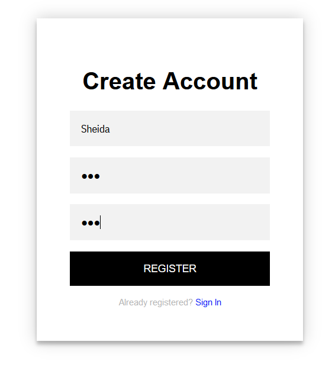
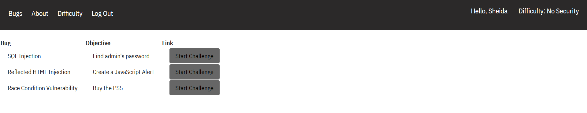
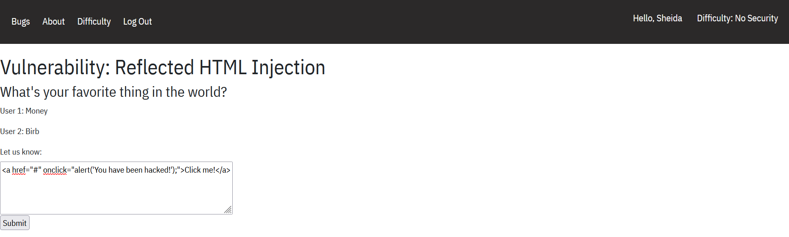
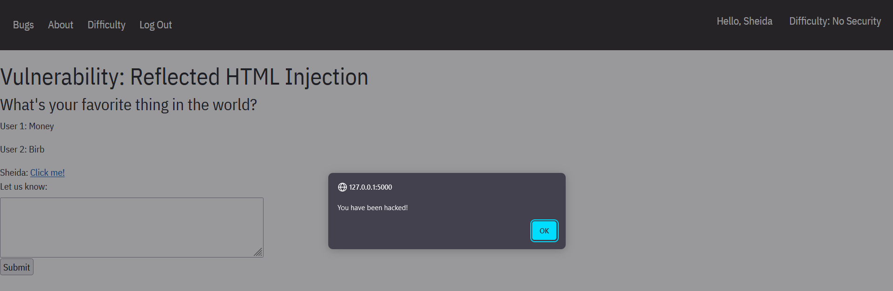
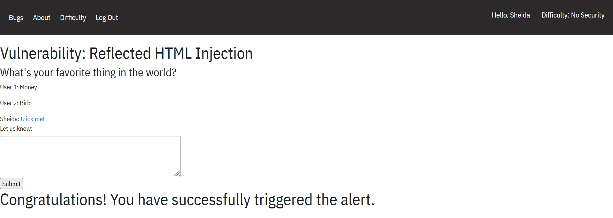
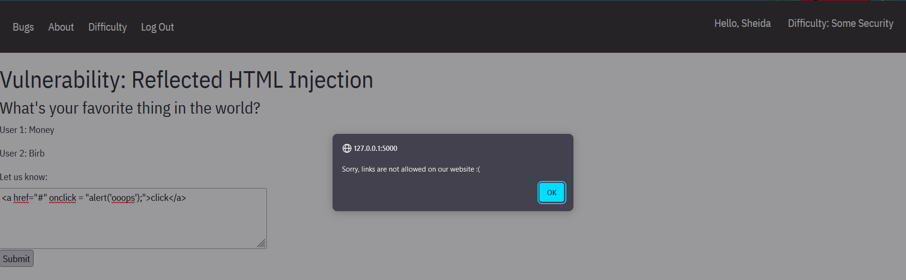
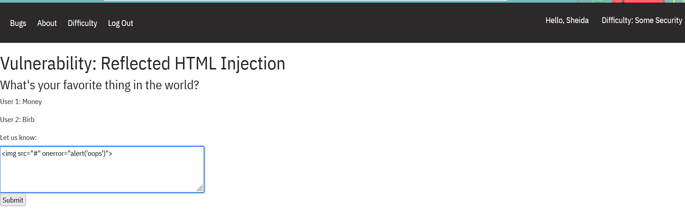
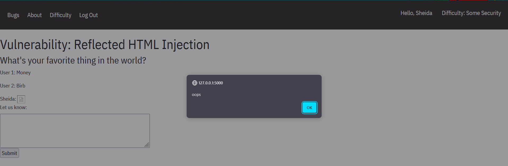
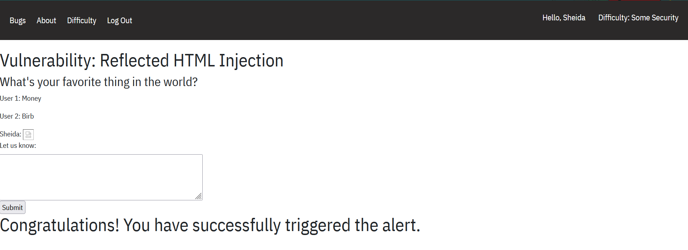
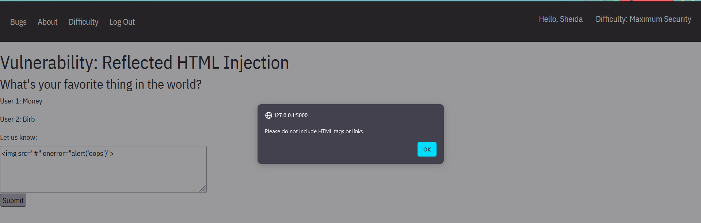

# Reflected HTML Injection
## What is HTML Injection?
HTML Injection Attack is a type of security vulnerability where an attacker injects malicious HTML or JavaScript code into a web page viewed by other users. 
This injected code can manipulate the content and behaviour of the web page, potentially leading to various harmful consequences such as stealing sensitive information, 
phishing attacks, or hijacking user sessions. HTML Injection typically occurs when a web application fails to properly validate or sanitize user input, allowing the attacker 
to insert their own code into the page.
## Starting the challenge 
To access the app run `docker compose up` in your terminal (make sure you're in the `app` directory).
It should make the server accessible at `http://localhost:5000`. Click on `Create an account` and register your username and password:

You will be redirected to the main bugs page. Locate "Reflected HTML Injection", and observe that the goal of the challenge is for us to make an alert show up on the screen. 
Click on the button.

## Level 1
Once you are at the `http://localhost:5000/html_injection` page, you'll see an input field. We can use this to post messages on the website. Since we need to create an alert,
we can post an HTML link tag that will trigger the alert once it's clicked on:

`<a href="#" onclick="alert("[your message]");">[Link message]</a>`

## Level 2
Once you change the level to `Some Security`, and head back to the challenge, you'll see that our previous attempt at posting links no longer works. This time we can post 
an image or video tag that will trigger an alert: ``

## Level 3
On this level: `Maximum Security`, no HTML tag or link can be submitted.

