# Race Condition Vulnerability Walkthrough
#### By Siddhant Das (Sid Das on Canvas) - 100830959
## Description
Buy the PS5 in <b> the Shop™</b>.
## Prerequisites
### Knowledge requirements
- HTTP requests
- Python
- Multithreading

### Tool requirements
- BurpSuite
- Python
- IDE of choice

## Level 1: No Security
After running the application, we will first log into the Very Buggy App (VBA) to access our challenge (If you don't have an account, go to registration).

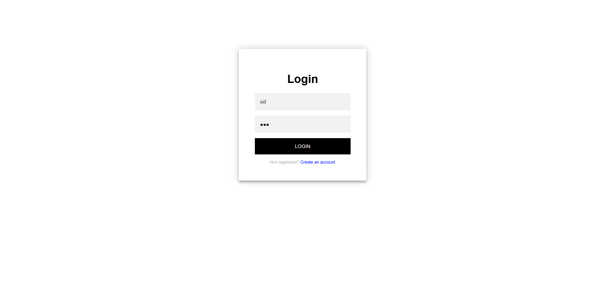

Then, we select the challenge called "Race Condition Vulnerability." 


Now that we are logged in and can see the shop's interface, we want to buy the PS5. However, our dilemma is that we only have $200 in our account, and the PS5 is $500. We can buy any item and sell it back for the same price.

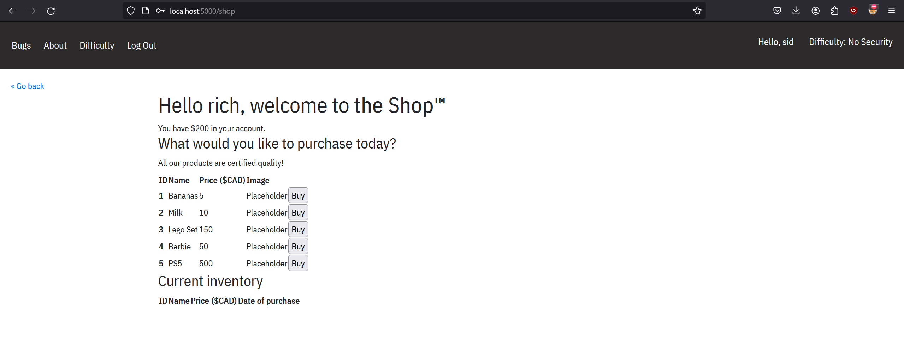

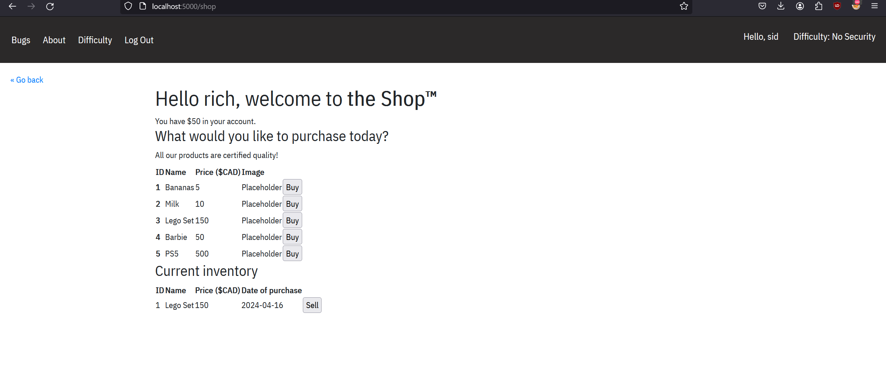

When we hit sell, it triggers the `/sell` endpoint with the inventory item's `id`. We will exploit this endpoint to sell the Lego set multiple times before it leaves the inventory. So, we fire up BurpSuite and intercept the sell POST request.

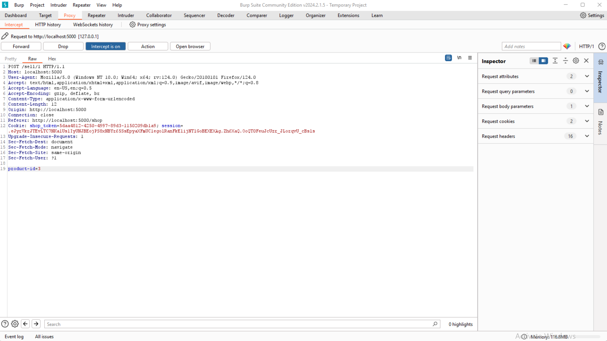

Then we send the request to the Burp Intruder and hit Ctrl+R repeatedly to send duplicates to the repeater (20 should suffice)

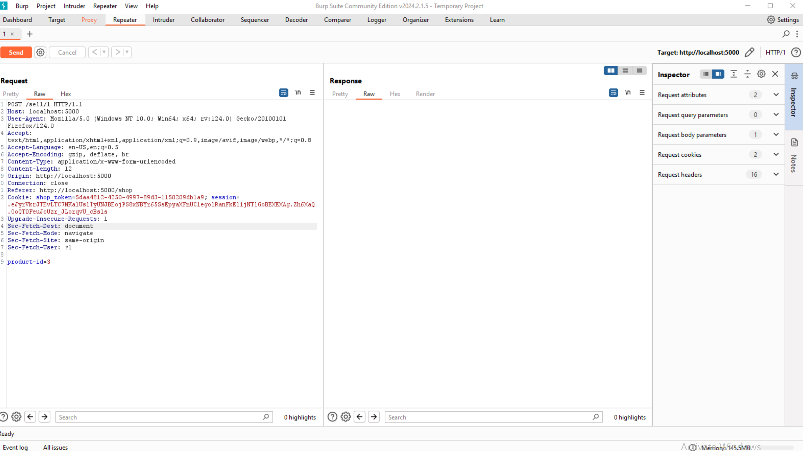

After that, click on the three-dotted buttons and select "Create tab group." Select all the tabs and put them in the tab group:

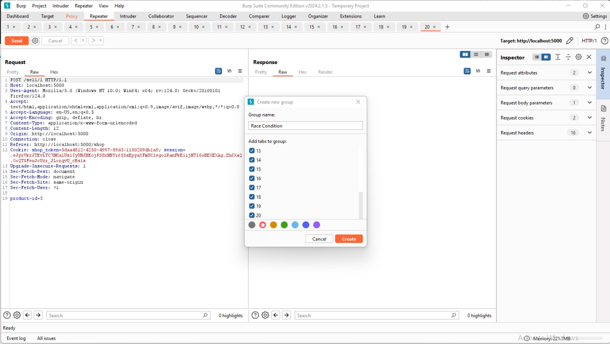

Select the arrow in the request, select "send group in parallel," and then hit send.

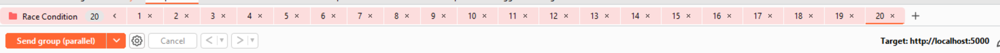

Now, refresh the application, and we can see that we have an extra $300.

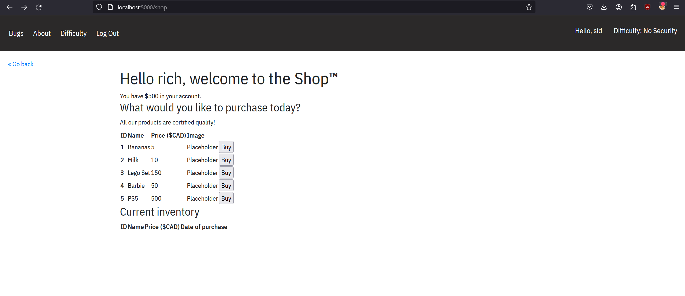

With this extra money, we can finally afford that PS5, so go ahead and buy it.

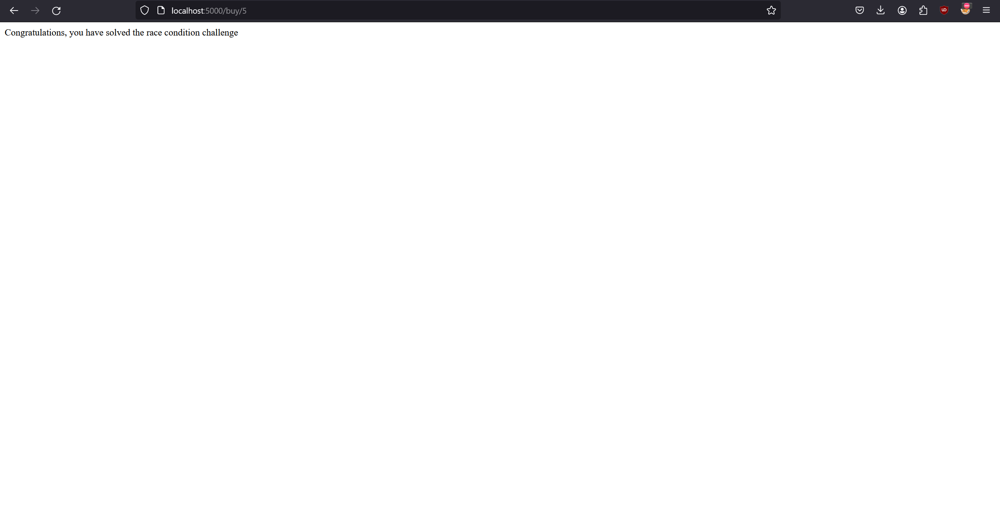

Congratulations on completing the race condition bug bounty.

## Level 2: Some Security
We can solve this on the next level, medium security level or "Some Security." Start by setting your difficulty to "Some Security" in the difficulty tab.

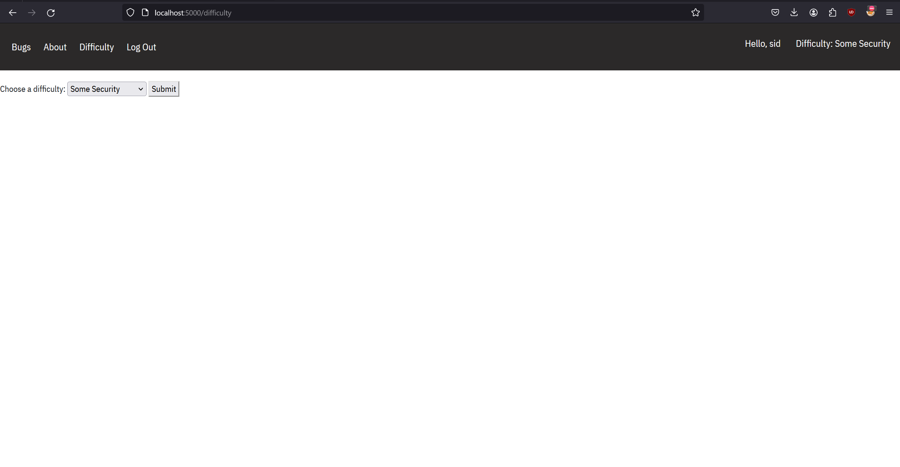

Whenever we buy something, we can't sell it back anymore or see the sell id. 

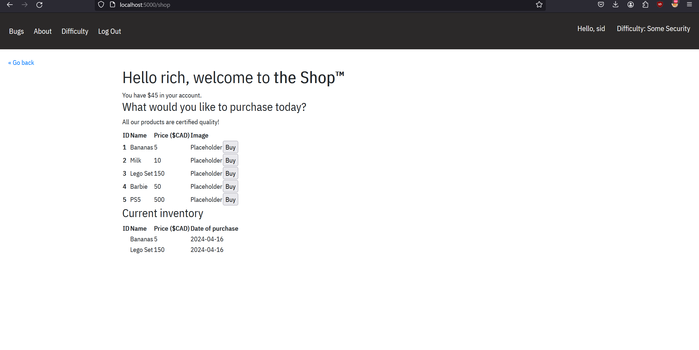

So, we will intercept a buy request.

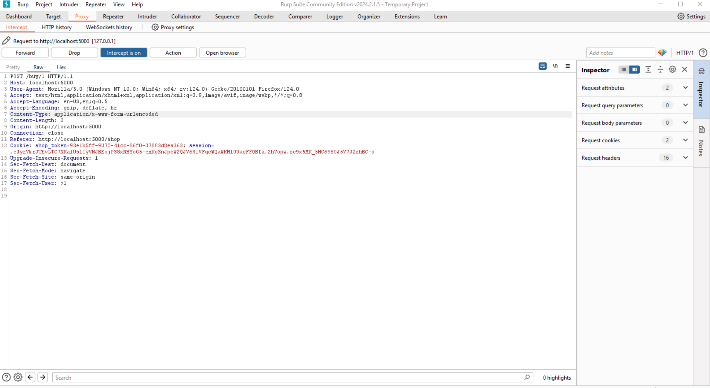

Rename the buy endpoint to sell (While `/sell` is gone from the client side, it is still exposed as an API).

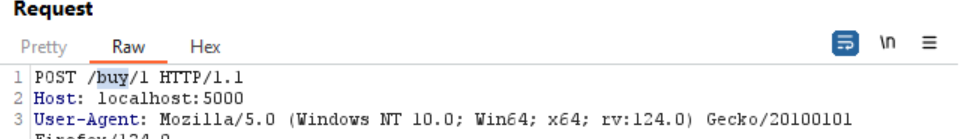

Since we are selling the Lego Set, the `product_id` is 3. We will put a request parameter called `product_id=3` and

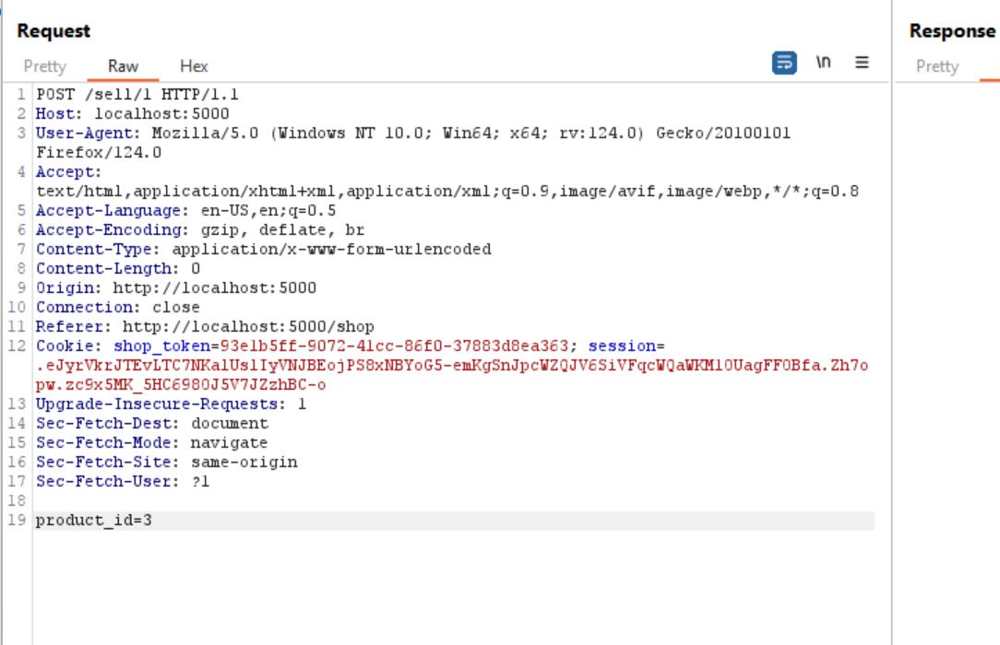

Just like level 1, we follow the steps and duplicate them into a tab group.

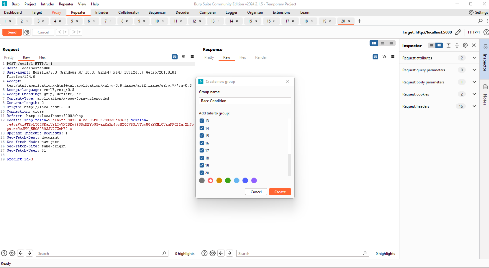

We will set them to be sent in parallel and hit send.

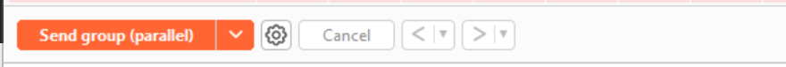

We finally have enough money to buy the PS5 and complete the challenge on level 2.

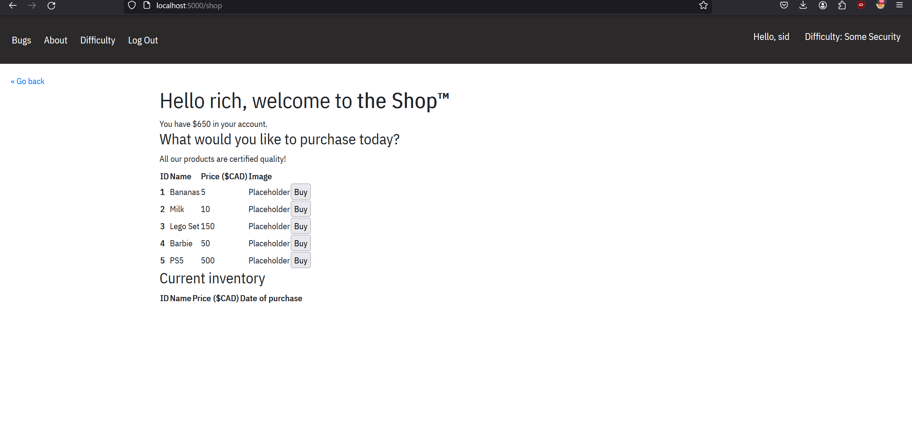

We have fully exploited a limited run race condition vulnerability. 

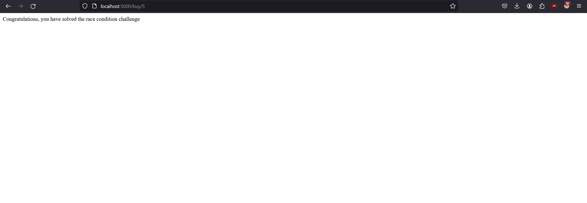

## Level 3: Maximum Security

Now, change the difficulty to maximum security.

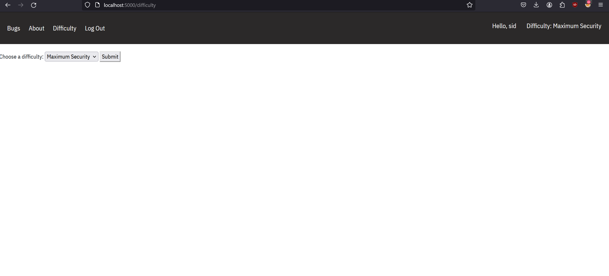

This is the final level, and I have made it impossible to solve this challenge because the vulnerable endpoint `/sell` is patched, so it no longer works for the race condition bug.

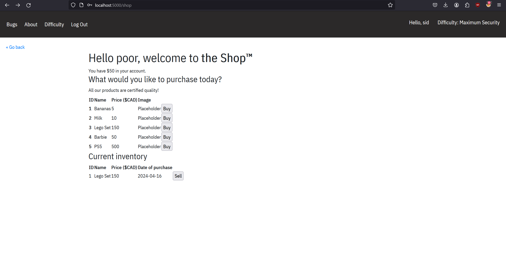

Even if you try, you will get this message: "Lock can't be processed."

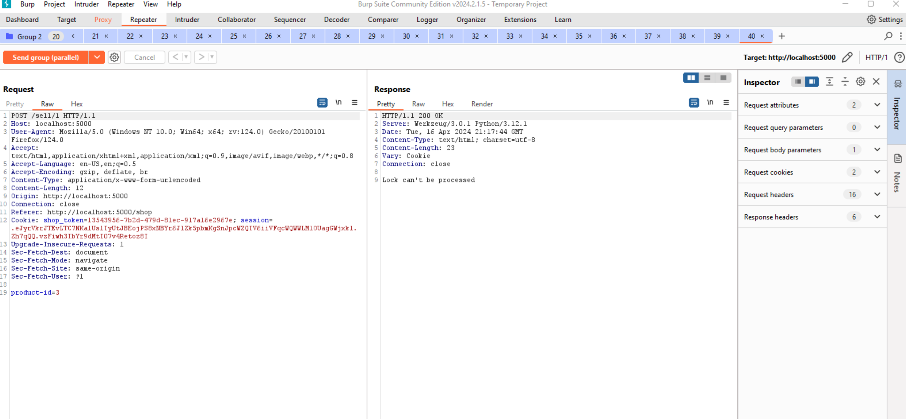

The Behind the Scenes section explains how I have secured the application from vulnerability.

## Behind the Scenes

The app runs on a `flask` backend and uses server-side rendering to serve HTML "templates" as well as static files (CSS and JS). I am using an ORM (Object Relation Mapping) library called `peewee` along with a `Sqlite` database to store users and transactions for the shop. The app itself uses a Postgresql database with the psycopg2 library. 

For this project, I will explain how I fixed the `/sell` endpoint to be secured from a race condition. This is the code for the vulnerable version.

```py
    @staticmethod
    @orm_db.connection_context()
    def sell(session_token: str, transaction_id: int):
        try:
            inventory_product = Inventory.get(Inventory.transaction_id == transaction_id)
            user = Users.get(session_token==Users.token)
        except DatabaseError as e:
            log.debug(e)
            return "Oopsie, an error occured, check server logs"

        new_balance = user.balance + inventory_product.value

        try:
            Inventory.delete().where(Inventory.transaction_id==inventory_product.transaction_id).execute()
            Users.update(balance=new_balance).where(Users.user_id==user.user_id).execute()
        except DatabaseError as e:
            log.info(e)
            return "Oopsie, an error occured, check server logs"        

        return ""
```

In the code above, I take a session token, which is created for any user logged into the shop, and a `transaction_id`. Then, I fetch the product from the inventory and the user as Python objects from the database. After that, I calculate the new balance and then delete the transaction (product from the inventory). After that, I update that user object with the new balance. If everything is successful, return an empty string to the sell endpoint controller.

For the maximum difficulty, I check if `session.get('difficulty) == '2'`. Then I make the controller use the code below instead.

```py
    @staticmethod
    @orm_db.connection_context()
    def sell2(session_token: str, transaction_id: int):
        user = Users.get(session_token==Users.token)
        lock = str(uuid4())
        with orm_db.atomic() as transaction:
            try:
                isLocked = Inventory2.update(lock=lock).where(Inventory2.transaction_id==transaction_id).where(Inventory2.user_id==user.user_id).where(Inventory2.lock=="").execute()
                transaction.commit()
            except DatabaseError as e:
                transaction.rollback()
                log.debug(e)
                return "Oopsie, an error occured, check server logs"
            
        if 1 != isLocked:
            return "Lock can't be processed"
        
        try:
            inventory_product = Inventory2.get(Inventory2.transaction_id == transaction_id)
        except DatabaseError as e:
            log.debug(e)
            return "Oopsie, an error occured, check server logs"
        
        if lock != inventory_product.lock:
            return "Lock check failed"
        
        new_balance = user.balance + inventory_product.value

        try:
            Inventory2.delete().where(Inventory2.transaction_id==inventory_product.transaction_id).execute()
            Users.update(balance=new_balance).where(Users.user_id==user.user_id).execute()
        except DatabaseError as e:
            log.debug(e)
            return "Oopsie, an error occured, check server logs" 
        
        return ""
```

The difference in this code is that I introduce a "lock" to the purchased item in the inventory. Before getting the inventory object, I update the inventory given the user's transaction with the lock value (generated by Python's `uuid` library). I pass it through the `atomic` context manager. This ensures the atomicity of the database transaction and allows the request to be processed only once the lock is processed; otherwise, the database can be rolled back. This lock mechanism and the atomic context manager prevent the race condition vulnerability from happening. Thus securing the application's feature.